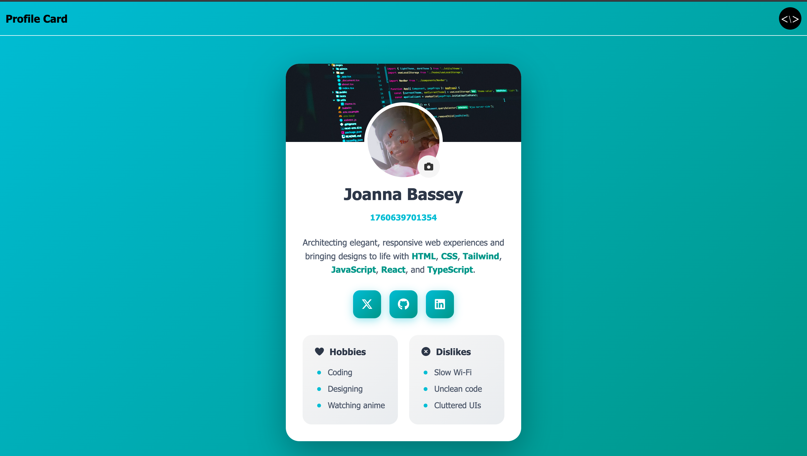

# Profile Card UI

An interactive and responsive profile card built with **HTML**, **CSS**, and **JavaScript** — fully accessible and ready for **automated testing**.

## About This Project

This project was created to demonstrate a simple, well-structured, and testable UI component.  
Each visible element includes a `data-testid` attribute to support automated testing frameworks like **Cypress**, **Playwright**, or **Jest**.  
It follows clean coding practices, semantic HTML, and accessibility guidelines.

## Features

- Modern and minimal UI
- Fully responsive layout
- ♿ Accessible HTML structure
- `data-testid` attributes for easy test automation
- ⚡ Built with vanilla JavaScript — no dependencies

## Tech Stack

- **HTML5**
- **CSS3 (Flexbox & Grid)**
- **JavaScript (ES6+)**

## Getting Started

1. **Clone the repository**
   ```bash
   git clone https://github.com/DevBytes-J/profile-card-ui.git
   ```
2. Navigate to the Project
   ```bash
   cd profile-card-ui
   ```
3. Run locally
   Simply open index.html in your browser.
   (No server or build tools required!)

   Preview
   

**Testing**

Each visible element includes a **`data-testid`** attribute, making this component ready for automated testing with tools like **Cypress**, **Playwright**, or **Jest**.

**Example Markup:**

```html


### Author **Joanna Bassey** Frontend Developer passionate about clean UI and
accessible design. > "Build interfaces that look good and feel even better."
```
